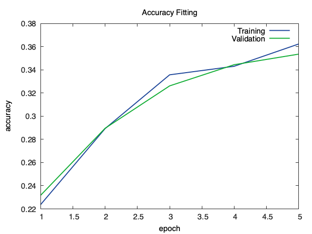

# trashnet
Code (only for the convolutional neural network) and dataset for mine and [Mindy Yang](http://github.com/yangmindy4)'s final project for [Stanford's CS 229: Machine Learning class](http://cs229.stanford.edu). Our paper can be found [here](http://cs229.stanford.edu/proj2016/poster/ThungYang-ClassificationOfTrashForRecyclabilityStatus-poster.pdf). The convolutional neural network results on the poster are dated since we continued working after the end of the quarter and  were able to achieve around 75% test accuracy (with 70/13/17 train/val/test split) after changing the weight initialization to the Kaiming method.

## Dataset
This repository contains the dataset that we collected. The dataset spans six classes: 
glass,  paper,  cardboard, plastic,  metal,and trash. 

Currently, the dataset consists of 2527 images:
- 501 glass
- 594 paper
- 403 cardboard
- 482 plastic
- 410 metal
- 137 trash

The pictures were taken by placing the object on a white posterboard and using sunlight and/or room lighting. The pictures have been resized down to 512 x 384, which can be changed in `data/constants.py` (resizing them involves going through step 1 in usage). The devices used were Apple iPhone 7 Plus, Apple iPhone 5S, and Apple iPhone SE.

The size of the original dataset, ~3.5GB, exceeds the git-lfs maximum size so it has been uploaded to Google Drive. If you are planning on using the Python code to preprocess the original dataset, then download `dataset-original.zip` from the link below and place the unzipped folder inside of the `data` folder.

**If you are using the dataset, please give a citation of this repository. The dataset can be downloaded [here](http://drive.google.com/drive/folders/0B3P9oO5A3RvSUW9qTG11Ul83TEE).**

## Installation

### Lua setup
We wrote code in [Lua](http://lua.org) using [Torch](http://torch.ch); you can find installation instructions
[here](http://torch.ch/docs/getting-started.html). You'll need the following Lua packages:

- [torch/torch7](http://github.com/torch/torch7)
- [torch/nn](http://github.com/torch/nn)
- [torch/optim](http://github.com/torch/optim)
- [torch/image](http://github.com/torch/image)
- [torch/gnuplot](http://github.com/torch/gnuplot)

After installing Torch, you can install these packages by running the following:

```bash
# Install using Luarocks
luarocks install torch
luarocks install nn
luarocks install optim
luarocks install image
luarocks install gnuplot
```

We also need [@e-lab](http://github.com/e-lab)'s [weight-init module](http://github.com/e-lab/torch-toolbox/blob/master/Weight-init/weight-init.lua), which is already included in this repository.

### CUDA support
Because training takes a while, you will want to use a GPU to get results in a reasonable amount of time. 
We used CUDA with a GTX 650 Ti with CUDA. To enable GPU acceleration with CUDA, you'll first need to install CUDA 6.5 or higher. 
Find CUDA installations [here](http://developer.nvidia.com/cuda-downloads).

Then you need to install following Lua packages for CUDA:
- [torch/cutorch](http://github.com/torch/cutorch)
- [torch/cunn](http://github.com/torch/cunn)

You can install these packages by running the following:

```bash
luarocks install cutorch
luarocks install cunn
```

### Python setup
Python is currently used for some image preprocessing tasks. The Python dependencies are:
- [NumPy](http://numpy.org)
- [SciPy](http://scipy.org)

You can install these packages by running the following:

```bash
# Install using pip
pip install numpy scipy
```

## Usage

### Step 1: Prepare the data
Unzip `data/dataset-resized.zip`.

If adding more data, then the new files must be enumerated properly and put into the appropriate folder in `data/dataset-original` and then preprocessed. 
Preprocessing the data involves deleting the `data/dataset-resized` folder and then calling `python resize.py` from `trashnet/data`. This will take around half an hour.

### Step 2: Train the model

options 

    -trainList                  data/one-indexed-files-notrash_train.txt
    -valList                    data/one-indexed-files-notrash_val.txt
    -testList                   data/one-indexed-files-notrash_test.txt
    -numClasses                 [5]
    -inputHeight                [384]
    -inputWidth                 [384]
    -scaledHeight               [256]
    -scaledWidth                [256]
    -numChannels                [3]
    -batchSize                  [32]
    -dataFolder                 [data/dataset-resized]
    -numEpochs                  [100]
    -learningRate               [1.25e-05]
    -lrDecayFactor              newLR = oldLR * <lrDecayFactor> [0.9]
    -lrDecayEvery               learning rate is decayed every <lrDecayEver> epochs [20]
    -weightDecay                L2 regularization [0.025]
    -weightInitializationMethod heuristic, xavier, xavier_caffe, or none [kaiming]
    -printEvery                 prints and saves the train and val acc and loss every <printEvery> epochs [1]
    -checkpointEvery            saves a snapshot of the model every <checkpointEvery> epochs [20]
    -checkpointName             checkpoint will be saved at ./<checkpointName>_#.t7 [checkpoints/checkpoint]
    -cuda                       [1]
    -gpu                        [0]
    -scale                      proportion of filters used in the architecture [1]

To start training 
```
th train.lua -cuda 0 -gpu 1 -numClasses 6  -numEpochs 5
```
Accuracy and Loss varying with epochs
```
13:54:27 Epoch 1/5: train acc: 0.223669, train loss: 3.145659, val acc: 0.231707, val loss: 1.761762    
13:58:22 Epoch 2/5: train acc: 0.289354, train loss: 2.283077, val acc: 0.289634, val loss: 1.729630    
14:02:18 Epoch 3/5: train acc: 0.335787, train loss: 2.091108, val acc: 0.326220, val loss: 1.733465    
14:06:09 Epoch 4/5: train acc: 0.343148, train loss: 1.976692, val acc: 0.344512, val loss: 1.714376 
14:10:59 Epoch 5/5: train acc: 0.362401, train loss: 1.938542, val acc: 0.353659, val loss: 1.703954  
..
14:11:05 Final accuracy on the train set: 0.362401      
14:11:05 Final accuracy on the val set: 0.353659        
14:11:19 Final accuracy on the test set: 0.331787 
...
ConfusionMatrix:
[[      12      44       1       3      25       0]   14.118% 
 [       6      85       0       0      12       0]   82.524% 
 [       1      51      15       0       4       0]   21.127% 
 [       8      40       0       5      19       0]   6.944% 
 [       6      41       0       1      26       0]   35.135% 
 [       1      13       0       0      12       0]]  0.000% 
 + average row correct: 26.641376316547% 
 + average rowUcol correct (VOC measure): 14.257506902019% 
 + global correct: 33.178654292343%
```

### Step 3: Test the model
```
th test.lua -cuda 0
```

### Step 4: View the results
```
th plot.lua -checkpoint checkpoints/checkpoint_final.t7 -outputDir checkpoints
```
Results from 5 epochs trained on macOS catalina



## Contributing
1. Fork it!
2. Create your feature branch: `git checkout -b my-new-feature`
3. Commit your changes: `git commit -m 'Add some feature'`
4. Push to the branch: `git push origin my-new-feature`
5. Submit a pull request

## Acknowledgments
- Thanks to the Stanford CS 229 autumn 2016-2017 teaching staff for a great class!
- [@e-lab](http://github.com/e-lab) for their [weight-init Torch module](http://github.com/e-lab/torch-toolbox/blob/master/Weight-init/weight-init.lua)

## TODOs
- finish the Usage portion of the README
- add specific results (and parameters used) that were achieved after the CS 229 project deadline
- add saving of confusion matrix data and creation of graphic to `plot.lua`
- rewrite the data preprocessing to only reprocess new images if the dimensions have not changed
